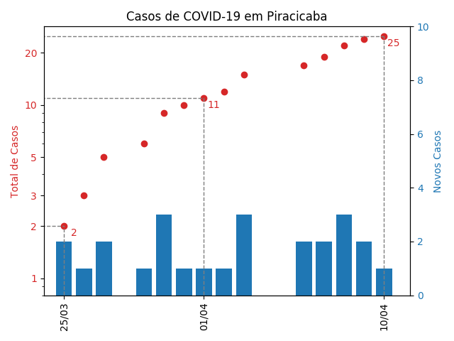

# COVID-19 em Piracicaba

Os dados referentes ao número de casos confirmados, o de mortes, e as informações sobre cada paciente são obtidas do [site da Prefeitura de Piracicaba](piracicaba.sp.gov.br/).
Embora não haja nenhuma página organizando os dados, eles podem ser extraídos da página com [notícias sobre o coronavírus na cidade](http://www.piracicaba.sp.gov.br/plantao+coronavirus+covid+19.aspx), ou nas [notícias em geral](https://www.piracicaba.sp.gov.br/categoria/principais+noticias.aspx) (com o título "COMUNICADO ...").

## Dados

Os dados extraídos são colocados em um arquivo com a seguinte formatação
'''
Data   Tipo   Número   Sexo   Idade  ## Observação
'''

O campo `Tipo` é usado para marcar casos confirmados (`P`) ou óbitos (`M`).
Quando não há informações sobre o paciente, os campos `Sexo` e `Idade` são marcados com `--`.

## Gráficos

### Total de Casos e Novos Casos por Dia

O gráfico é gerado pelo script localizado em `scripts/confirmados.py`, e o resultado é salvo na pasta `img`.

