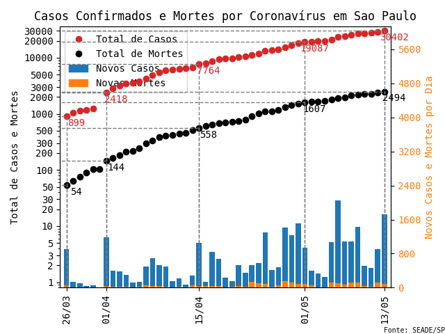
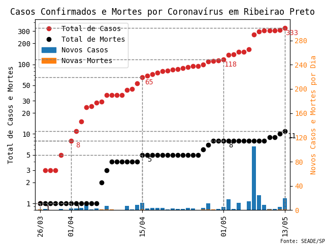
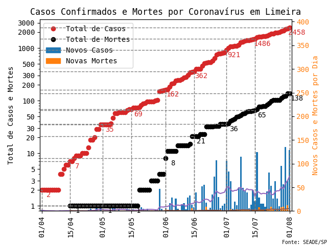

# COVID-19 em Piracicaba

## Dados

Os dados referentes ao número de casos confirmados, o de mortes, e as informações sobre cada paciente são obtidas do [site da Prefeitura de Piracicaba](piracicaba.sp.gov.br/).
Embora não haja nenhuma página organizando os dados, eles podem ser extraídos da página com [notícias sobre o coronavírus na cidade](http://www.piracicaba.sp.gov.br/plantao+coronavirus+covid+19.aspx), ou nas [notícias em geral](https://www.piracicaba.sp.gov.br/categoria/principais+noticias.aspx) (com o título "COMUNICADO ...").

Os dados extraídos são colocados em um arquivo com a seguinte formatação  
`Data   Tipo   Número   Sexo   Idade  ## Observação`

O campo `Tipo` é usado para marcar casos confirmados (`P`) ou óbitos (`M`).
Quando não há informações sobre o paciente, os campos `Sexo` e `Idade` são marcados com `--`.

Caso seja reportado que não houve novos casos confirmados, é preciso incluir uma entrada com contagem `0`.
Isso é feito para indicar que há informações sobre esse dia e evitar que apareçam lacunas nos dados.
As lacunas devem indicar que não houve nenhum dado reportado, o que ocorre geralmente em fins de semana.

No caso do número de mortes, não é necessário colocar uma entrada com contagem 0, pois o programa completa essas omissões automaticamente.

## Gráficos

Para atualizar os gráficos, basta rodar o script `covid.py` e os arquivos na pasta `img` serão modificados para incluir os dados mais recentes.
Se quiser apenas vê-los, descomente o comando `# pir.atualiza_graf(show=True)  # Mostra figuras mas não salva` no fim do arquivo.

São gerados os seguintes gráficos:
* Novos casos confirmados por dia (`novoscasos`)
* Total de casos confirmados (`totalcasos`)
* Mortes por dias (`novasmortes`)
* Total de mortes (`totalmortes`)
* Combinação dos novos casos por dia e do total de casos (`casosconfirmados`)
* Combinação das mortes por dia e do total de mortes (`mortes`)
* Combinação de todos os 4 tipos de dados (arquivo sem sufixo)

## Outras Cidades

* Campinas

  Fonte: http://www.campinas.sp.gov.br/noticias.php e https://covid-19.campinas.sp.gov.br/
  
  

## Dados do SEADE

A fundação SEADE disponibiliza os dados referentes a todo o estado de São Paulo no [seu site](https://www.seade.gov.br/coronavirus/) e em um [repositório no git-hub](https://github.com/seade-R/dados-covid-sp).

Utilizando o script, é possível plotar os gráficos de qualquer cidade no estado.

