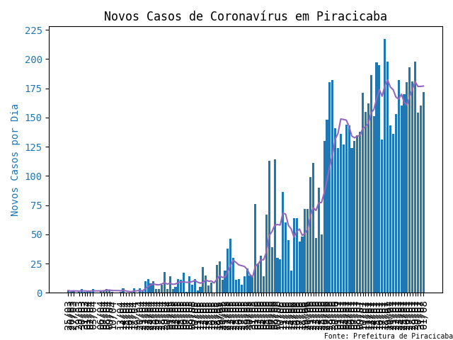
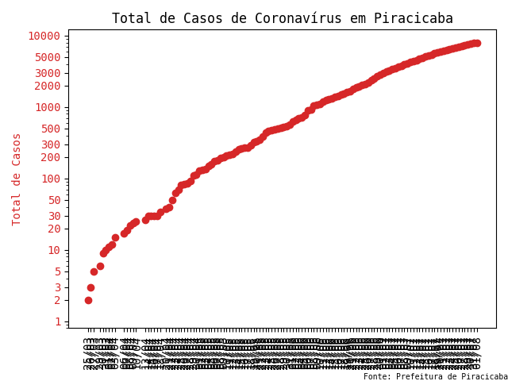
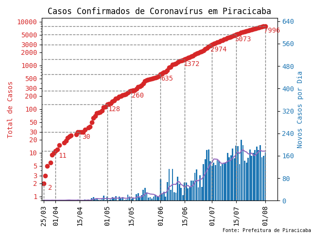
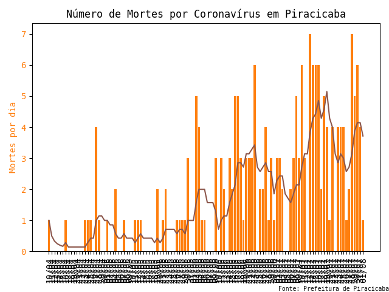
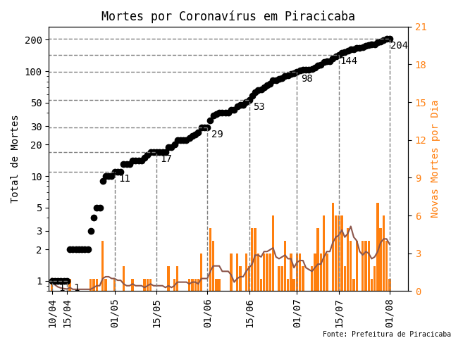

# Casos de Coronavírus em Piracicaba

Os gráficos a seguir são gerados pela função `atualiza_graf`.

Novos casos confirmados por dia:  

Total de casos confirmados:  

Combinação dos novos casos por dia e do total de casos:  

Mortes por dias:  

Total de mortes:  

Combinação das mortes por dia e do total de mortes:  

Combinação de todos os 4 tipos de dados:  

