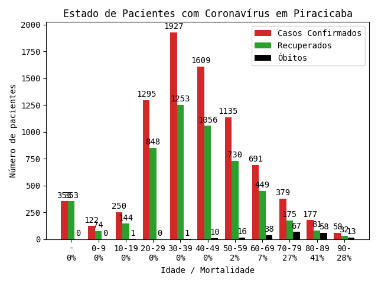
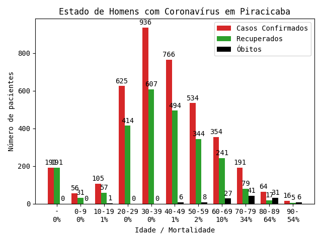
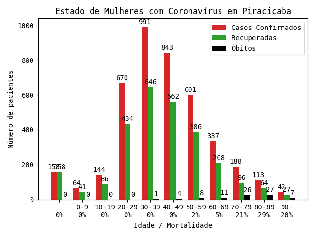
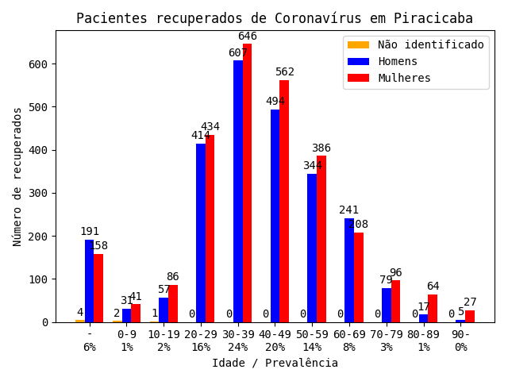
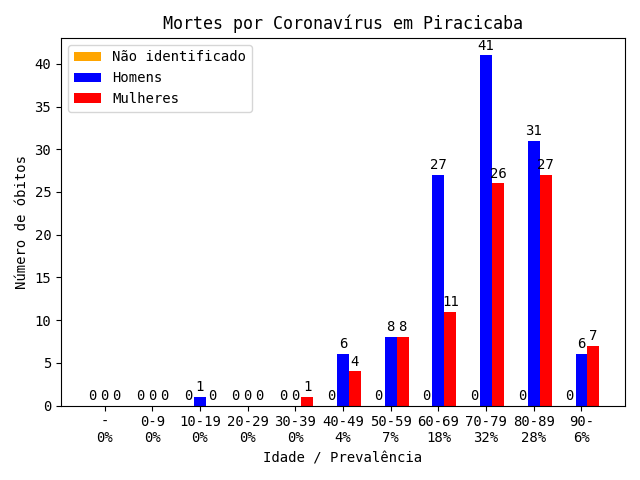

# Dados Sobre O Estado, Sexo, E Idade Dos Pacientes De Piracicaba

Gráficos gerados pela função `graf_detalhes`:
(São considerados recuperados os pacientes que foram reportados como infectados há mais de 14 idas e não faleceram no período)

Estado de todos os pacientes:

Estado dos homens infectados:

Estado das mulheres infectadas:

Distribuição por sexo e idade dos casos positivos de coronavírus:

Distribuição por sexo e idade dos pacientes recuperados do coronavírus:

Distribuição por sexo e idade dos óbitos por coronavírus:

